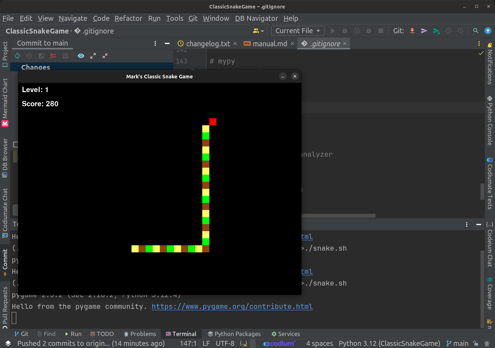

# Classic Snake Game

---


## Quick Start 

### Playing The Game

If you've never played the late 1970's version of Snake, the rules are simple:

1. Use the Cursor (Arrow) Keys to control the snake's direction.
2. Avoid hitting the perimeter as this will cause the snake to die.
3. Avoid turning the snake back on itself as this will cause the snake to die.
4. Eat as many Red apples as possible, as this causes the snake to grow and the player to earn points!

---

### Enhancements To Classic Snake In This Version

This version of the classic snake game includes some enhancements not typically found in snake.

1. Golden Apples: Eating a Golden Apple will cause the snake to grow longer than a typical red apple and will increase the player's score more rapidly.
2. Poison Apples: Eating a Poison Apple will cause the snake to lose its tail and the player to lose points.
3. Snake size: In early levels the snake will use a larger block size. As the game levels increase, the snake will be reduced in block size by 50%.
4. Speed: As levels increase the snakes speed is increased, requiring more skill to control the snake.
5. Target length: As levels increase, the snake is required to grow much longer to complete a level.

---

## Requirements

To play Snake you will need to have Python 3.12 or greater installed on your system. If you run Linux or MacOS you should already have Python 3 installed. However, I have included instructions for doing so on Windows, MacOS, and Linux, just in case:

### Instructions for Installing Python 3.12 or Later

#### **Linux**

1. **Update Package List**:
   ```sh
   sudo apt update
   ```

2. **Install Dependencies**:
   ```sh
   sudo apt install -y software-properties-common
   ```

3. **Add Deadsnakes PPA (for Ubuntu)**:
   ```sh
   sudo add-apt-repository ppa:deadsnakes/ppa
   sudo apt update
   ```

4. **Install Python 3.12**:
   ```sh
   sudo apt install -y python3.12 python3.12-venv python3.12-dev
   ```

5. **Verify Installation**:
   ```sh
   python3.12 --version
   ```

   **For Other Distributions**:
   - Use your package manager to install the required dependencies.
   - Download the source code from [Python's official website](https://www.python.org/downloads/release/python-3120/).
   - Extract the tarball and compile Python:

     ```sh
     tar -xf Python-3.12.0.tar.xz
     cd Python-3.12.0
     ./configure
     make
     sudo make altinstall
     ```

#### **macOS**

1. **Install Homebrew** (if not already installed):
   ```sh
   /bin/bash -c "$(curl -fsSL https://raw.githubusercontent.com/Homebrew/install/HEAD/install.sh)"
   ```

2. **Update Homebrew**:
   ```sh
   brew update
   ```

3. **Install Python 3.12**:
   ```sh
   brew install python@3.12
   ```

4. **Verify Installation**:
   ```sh
   python3.12 --version
   ```

#### **Windows 10 and 11**

1. **Download Python Installer**:
   - Go to [Python's official download page](https://www.python.org/downloads/release/python-3120/).
   - Download the Windows installer (`.exe`) for Python 3.12.

2. **Run the Installer**:
   - Open the downloaded installer.
   - Check the box that says "Add Python 3.12 to PATH".
   - Select "Customize installation" if you want to choose optional features.
   - Click "Install Now" to proceed with the installation.

3. **Verify Installation**:
   - Open Command Prompt (cmd) and run:

     ```sh
     python --version
     ```

4. **Environment Variables (if not added automatically)**:
   - Open the Start Menu and search for "Environment Variables".
   - Click on "Edit the system environment variables".
   - In the System Properties window, click on "Environment Variables...".
   - Under "System variables", find the `Path` variable and click "Edit...".
   - Click "New" and add the path to the Python installation directory (e.g., `C:\Python312\`).
   - Click "OK" to close all windows.

---

## Starting the Game

### Instructions for Running the Game

#### **Windows**

1. **Ensure Python 3.12 or Later is Installed**:
   - Open Command Prompt and run:
     ```sh
     python --version
     ```
   - Ensure it returns `Python 3.12.x`.

2. **Navigate to the Game Directory**:
   - Open Command Prompt and navigate to your game directory:
     ```sh
     cd path\to\your_game_project
     ```

3. **Install Dependencies**:
   - Run the following command to install the required packages:
     ```sh
     pip install -r requirements.txt
     ```

4. **Run the Game**:
   - You can run the game by executing the `run_game.bat` script:
     ```sh
     run_game.bat
     ```
   - Alternatively, you can directly run the main game file:
     ```sh
     python -m src.game
     ```

#### **macOS**

1. **Ensure Python 3.12 or Later is Installed**:
   - Open Terminal and run:
     ```sh
     python3 --version
     ```
   - Ensure it returns `Python 3.12.x`.

2. **Navigate to the Game Directory**:
   - Open Terminal and navigate to your game directory:
     ```sh
     cd /path/to/your_game_project
     ```

3. **Install Dependencies**:
   - Run the following command to install the required packages:
     ```sh
     pip3 install -r requirements.txt
     ```

4. **Run the Game**:
   - You can run the game by executing the `run_game.sh` script:
     ```sh
     ./run_game.sh
     ```
   - Ensure the script has execution permissions:
     ```sh
     chmod +x run_game.sh
     ```
   - Alternatively, you can directly run the main game file:
     ```sh
     python3 -m src.game
     ```

#### **Linux**

1. **Ensure Python 3.12 or Later is Installed**:
   - Open Terminal and run:
     ```sh
     python3 --version
     ```
   - Ensure it returns `Python 3.12.x` or greater.

2. **Navigate to the Game Directory**:
   - Open Terminal and navigate to your game directory:
     ```sh
     cd /path/to/your_game_project
     ```

3. **Install Dependencies**:
   - Run the following command to install the required packages:
     ```sh
     pip3 install -r requirements.txt
     ```

4. **Run the Game**:
   - You can run the game by executing the `run_game.sh` script:
     ```sh
     ./run_game.sh
     ```
   - Ensure the script has execution permissions:
     ```sh
     chmod +x run_game.sh
     ```
   - Alternatively, you can directly run the main game file:
     ```sh
     python3 -m src.game
     ```

---

## Additional Information

Please see the manual.md file in the docs directory if you have any issues or simply want to learn more about the game or develop your own version, or make modifications.

Information on the code files can be found in the docs/code directory.
