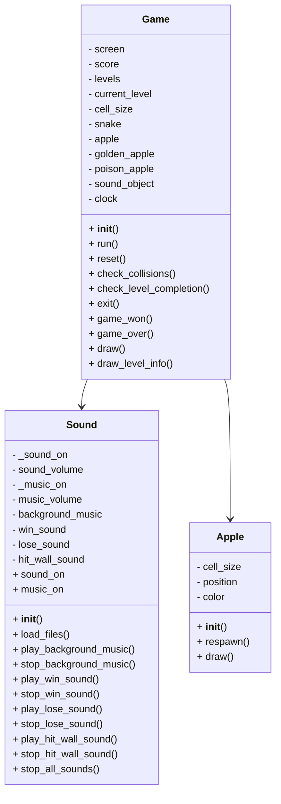

# Classic Snake Game Architecture Document

---

## Overview
The game consists of a classic snake game where the player controls a snake to eat apples and grow in length. The game includes multiple levels with different challenges and features such as golden apples and poison apples. Sound effects and background music enhance the gaming experience.

## Components
1. **Snake Class (src/snake.py):**
   - Represents the snake entity in the game.
   - Handles movement, growth, trimming, changing direction, and drawing of the snake.

2. **Apple Class (src/apple.py):**
   - Represents the apple entity that the snake eats to grow.
   - Manages the position, color, respawning, and drawing of the apple.

3. **Level Class (src/level.py):**
   - Defines different levels with varying parameters like cell size, target length, speed, and special apple types.
   - Contains a list of predefined levels with specific configurations.

4. **Sound Class (src/sound.py):**
   - Manages sound effects and background music for the game.
   - Provides functions to play, stop, and adjust volume for different sounds.

5. **Game Class (src/game.py):**
   - Orchestrates the game flow, including level progression, collision detection, game over conditions, and drawing elements on the screen.
   - Utilizes instances of Snake, Apple, Level, and Sound classes to create the game environment.

## Game Loop
1. **Initialization:**
   - Sets up the game window, initializes fonts, creates instances of game entities, and loads assets.

2. **Main Loop (run method):**
   - Handles user input, updates game state, checks for collisions, and manages level completion.
   - Controls the game flow by calling appropriate methods based on player actions.

3. **Resetting:**
   - Resets the game state, optionally changing the level, and prepares for a new game session.

4. **Collision Detection:**
   - Detects collisions between the snake and apples to trigger appropriate actions.

5. **Level Completion:**
   - Checks if the player has achieved the target length for the current level to progress to the next level.

6. **Drawing:**
   - Renders game elements on the screen, including the snake, apples, level information, and game screens.

## Sound Management
- Sound effects and background music are controlled by the Sound class.
- Players can toggle sound and music on/off, adjust volume levels, and play specific sounds based on game events.

## Future Improvements
- Implement additional game features like power-ups, obstacles, or different game modes.
- Enhance graphics and visual effects to improve the overall gaming experience.
- Add more levels with unique challenges and variations in gameplay.

---

## Classes and Relationships:

### Game Class:
Contains the main game logic, such as initializing the game, running the game loop, handling collisions, checking level completion, and managing game state.
Has attributes like screen, score, levels, current_level, cell_size, snake, apple, golden_apple, poison_apple, sound_object, clock.
Utilizes the Snake and Apple classes for player and apple objects.
Interacts with the Sound class for playing background music and sound effects.

### Sound Class:
Manages game sounds, including background music, win sound, lose sound, and hit wall sound.
Handles loading sound files, controlling sound volume, and playing/stopping sounds based on game events.
Utilizes pygame.mixer for sound playback.

### Apple Class:
Represents the apple object in the game.
Contains methods for initializing the apple position, respawning, and drawing the apple on the game surface.

### Mermaid Class Diagram:

This Mermaid class diagram represents the relationships between the Game, Sound, and Apple classes in the Python Classic Snake Game project.
