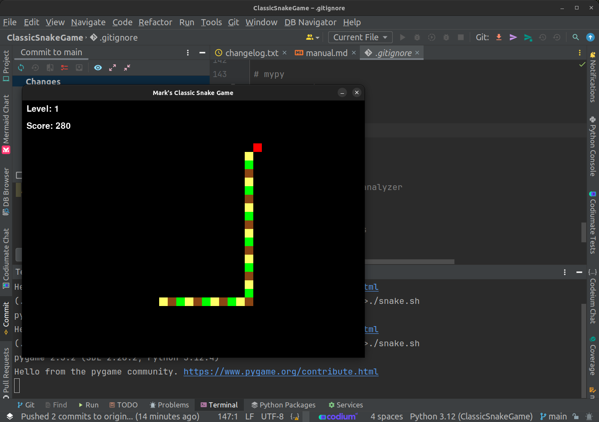

# Classic Snake Game

---



## Motivation
I recently spent a considerable amount of time with a 5-year-old who found video games very enticing. When he became bored with the games on his tablet, I wrote a small snake game for him to play. The initial game took  approximately 20 minutes to code up and entertained him for hours. However, after he played the game a while, it became clear he needed more of a challenge from the crude game, and some of the bugs in the game needed to be fixed. So, I slowly iterated over the simple game until it became a version of the Classic Snake game worthy of a 5-year-old. 

## Information
Over the past 40+ years I've written many versions of snake. It was one of the first games I ever wrote and I wrote my first version in BASIC on a Tandy Color Computer, using ASCII characters for the snake and apple. I wrote later versions in 6809, 6502, and Z80 assembly. Then I moved on to using Pascal, with a small foray into Forth, and then C and eventually C++ in the 90s. With C and C++ being used on A Tandy 1000 SX. 

The version I present here is still very simple, though it has 10 levels and more can be added, different apple types, including a poison apple that will chop off the tail of your snake and reset set your score. Each level has a target length the snake must reach to complete the level. The game displays the score and level information on the screen for player reference. The game includes some sounds and music I grabbed from the internet a long while back. So I am not sure who to credit for the audio. If you know who created these sounds please let me know. I would love to credit them! 

The sounds original file names are:
- 8bit-music-for-game-68698.mp3
- game-over-arcade-6435.mp5
- level-up-enhancement-8-bit-retro-sound-effect-153002.mp3

## Game Play 

---

### Playing The Game

If you've never played the late 1970's version of Snake, the rules are simple:

1. Use the Cursor (Arrow) Keys to control the snake's direction.
2. Avoid hitting the perimeter as this will cause the snake to die.
3. Avoid turning the snake back on itself as this will cause the snake to die.
4. Eat as many Red apples as possible, as this causes the snake to grow and the player to earn points!

---

### Enhancements To Classic Snake In This Version

This version of the classic snake game includes some enhancements not typically found in snake.

1. Golden Apples: Eating a Golden Apple will cause the snake to grow longer than a typical red apple and will increase the player's score more rapidly.
2. Poison Apples: Eating a Poison Apple will cause the snake to lose its tail and the player to lose points.
3. Snake size: In early levels the snake will use a larger block size. As the game levels increase, the snake will be reduced in block size by 50%.
4. Speed: As levels increase the snakes speed is increased, requiring more skill to control the snake.
5. Target length: As levels increase, the snake is required to grow much longer to complete a level.

---

## Requirements

To play Snake you will need to have Python 3.12 or greater installed on your system. If you run Linux or MacOS you should already have Python 3 installed. However, I have included instructions for doing so just in case:

### Instructions for Installing Python 3.12 or Later

#### **Linux**

1. **Update Package List**:
   ```sh
   sudo apt update
   ```

2. **Install Dependencies**:
   ```sh
   sudo apt install -y software-properties-common
   ```

3. **Add Deadsnakes PPA (for Ubuntu)**:
   ```sh
   sudo add-apt-repository ppa:deadsnakes/ppa
   sudo apt update
   ```

4. **Install Python 3.12**:
   ```sh
   sudo apt install -y python3.12 python3.12-venv python3.12-dev
   ```

5. **Verify Installation**:
   ```sh
   python3.12 --version
   ```

   **For Other Distributions**:
   - Use your package manager to install the required dependencies.
   - Download the source code from [Python's official website](https://www.python.org/downloads/release/python-3120/).
   - Extract the tarball and compile Python:

     ```sh
     tar -xf Python-3.12.0.tar.xz
     cd Python-3.12.0
     ./configure
     make
     sudo make altinstall
     ```

#### **macOS**

1. **Install Homebrew** (if not already installed):
   ```sh
   /bin/bash -c "$(curl -fsSL https://raw.githubusercontent.com/Homebrew/install/HEAD/install.sh)"
   ```

2. **Update Homebrew**:
   ```sh
   brew update
   ```

3. **Install Python 3.12**:
   ```sh
   brew install python@3.12
   ```

4. **Verify Installation**:
   ```sh
   python3.12 --version
   ```

#### **Windows 10 and 11**

1. **Download Python Installer**:
   - Go to [Python's official download page](https://www.python.org/downloads/release/python-3120/).
   - Download the Windows installer (`.exe`) for Python 3.12.

2. **Run the Installer**:
   - Open the downloaded installer.
   - Check the box that says "Add Python 3.12 to PATH".
   - Select "Customize installation" if you want to choose optional features.
   - Click "Install Now" to proceed with the installation.

3. **Verify Installation**:
   - Open Command Prompt (cmd) and run:

     ```sh
     python --version
     ```

4. **Environment Variables (if not added automatically)**:
   - Open the Start Menu and search for "Environment Variables".
   - Click on "Edit the system environment variables".
   - In the System Properties window, click on "Environment Variables...".
   - Under "System variables", find the `Path` variable and click "Edit...".
   - Click "New" and add the path to the Python installation directory (e.g., `C:\Python312\`).
   - Click "OK" to close all windows.

### Additional Information

### Creating a Virtual Environment (Recommended for Development)

1. **Create a Virtual Environment**:
   ```sh
   python3.12 -m venv myenv
   ```

2. **Activate the Virtual Environment**:

   - **Linux/macOS**:
     ```sh
     source myenv/bin/activate
     ```

   - **Windows**:
     ```sh
     .\myenv\Scripts\activate
     ```

3. **Deactivate the Virtual Environment**:
   ```sh
   deactivate
   ```

These instructions will help you install Python 3.12 or later on Linux, macOS, and Windows 10/11, along with setting up and using a virtual environment for development.


### Starting the Game

### Instructions for Running the Game

#### **Windows**

1. **Ensure Python 3.12 or Later is Installed**:
   - Open Command Prompt and run:
     ```sh
     python --version
     ```
   - Ensure it returns `Python 3.12.x`.

2. **Navigate to the Game Directory**:
   - Open Command Prompt and navigate to your game directory:
     ```sh
     cd path\to\your_game_project
     ```

3. **Install Dependencies**:
   - Run the following command to install the required packages:
     ```sh
     pip install -r requirements.txt
     ```

4. **Run the Game**:
   - You can run the game by executing the `run_game.bat` script:
     ```sh
     run_game.bat
     ```
   - Alternatively, you can directly run the main game file:
     ```sh
     python -m src.game
     ```

#### **macOS**

1. **Ensure Python 3.12 or Later is Installed**:
   - Open Terminal and run:
     ```sh
     python3 --version
     ```
   - Ensure it returns `Python 3.12.x`.

2. **Navigate to the Game Directory**:
   - Open Terminal and navigate to your game directory:
     ```sh
     cd /path/to/your_game_project
     ```

3. **Install Dependencies**:
   - Run the following command to install the required packages:
     ```sh
     pip3 install -r requirements.txt
     ```

4. **Run the Game**:
   - You can run the game by executing the `run_game.sh` script:
     ```sh
     ./run_game.sh
     ```
   - Ensure the script has execution permissions:
     ```sh
     chmod +x run_game.sh
     ```
   - Alternatively, you can directly run the main game file:
     ```sh
     python3 -m src.game
     ```

#### **Linux**

1. **Ensure Python 3.12 or Later is Installed**:
   - Open Terminal and run:
     ```sh
     python3 --version
     ```
   - Ensure it returns `Python 3.12.x` or greater.

2. **Navigate to the Game Directory**:
   - Open Terminal and navigate to your game directory:
     ```sh
     cd /path/to/your_game_project
     ```

3. **Install Dependencies**:
   - Run the following command to install the required packages:
     ```sh
     pip3 install -r requirements.txt
     ```

4. **Run the Game**:
   - You can run the game by executing the `run_game.sh` script:
     ```sh
     ./run_game.sh
     ```
   - Ensure the script has execution permissions:
     ```sh
     chmod +x run_game.sh
     ```
   - Alternatively, you can directly run the main game file:
     ```sh
     python3 -m src.game
     ```

---

## Making The Game You Own

If you are a python developer/tinkerer, you can add new features to the game easily. The game is created from a half dozen simple classes that organize the code for easy modification. You can learn more about each class and its purpose in the docs/code directory.

Even if you don't know how to program you can still modify some game settings to your liking. In the levels.py file you will find a python list names LEVELS that controls the various level attributes. You can change these to your liking making each level harder or easier, turn on/off Golden Apples and Bad Apples, etc. You can even change the music files found in the assets directory as long as you either modify the filenames in the sound.py file or rename the new files to match the names of the old files.

In short, this game was created to share a bit of nostalgia and history with a 5-year-old who really only wanted to play a game! So take it, make it your own, and enjoy! The only requirement is to have fun! If you do modify the game I would greatly appriciate it if you would credit me and the leave in the request for info on the creator of the audio files (which were freely available in the internet from somewhere...). However, even this is not required. It just being neighborly.


### Additional Notes

If you plan on modifying the game it is recommended you maintain the requirements file and project structure. The following are some helpful notes:

- **Requirements File**:
  Ensure you have the `requirements.txt` file in your project directory that lists all necessary dependencies. For example:
  ```txt
  pygame
  # Add any other dependencies here
  ```

- **Virtual Environment (Recommended)**:
  - **Creating a Virtual Environment**:
    ```sh
    python3 -m venv myenv
    ```
  - **Activating the Virtual Environment**:
    - **Windows**:
      ```sh
      .\myenv\Scripts\activate
      ```
    - **macOS/Linux**:
      ```sh
      source myenv/bin/activate
      ```
  - **Installing Dependencies in the Virtual Environment**:
    ```sh
    pip install -r requirements.txt
    ```
